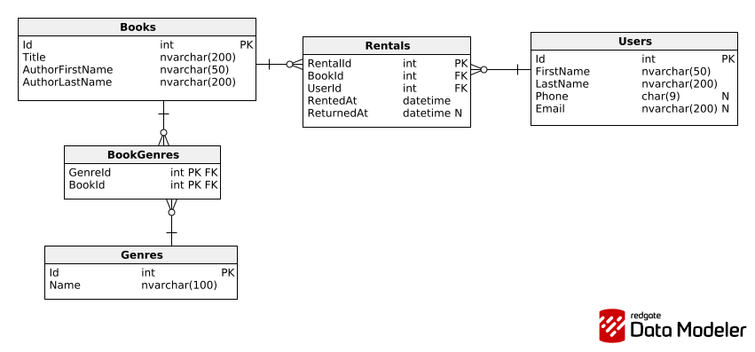

# Przykłady zadań i bazy danych na kolokwium z EntityFrameworkCore
- Kontekst bazy w projekcie został utworzony w podejściu CodeFirst.
- W kontrolerze `BooksController` znajdują się przykłady treści zadań, które mogą pojawić się na kolokwium.
- W serwisie `DbService` znajdują się implementacje logiki do poszczególnych zadań.
- Program operuje na bazie danych (plik `ERD.png`):
